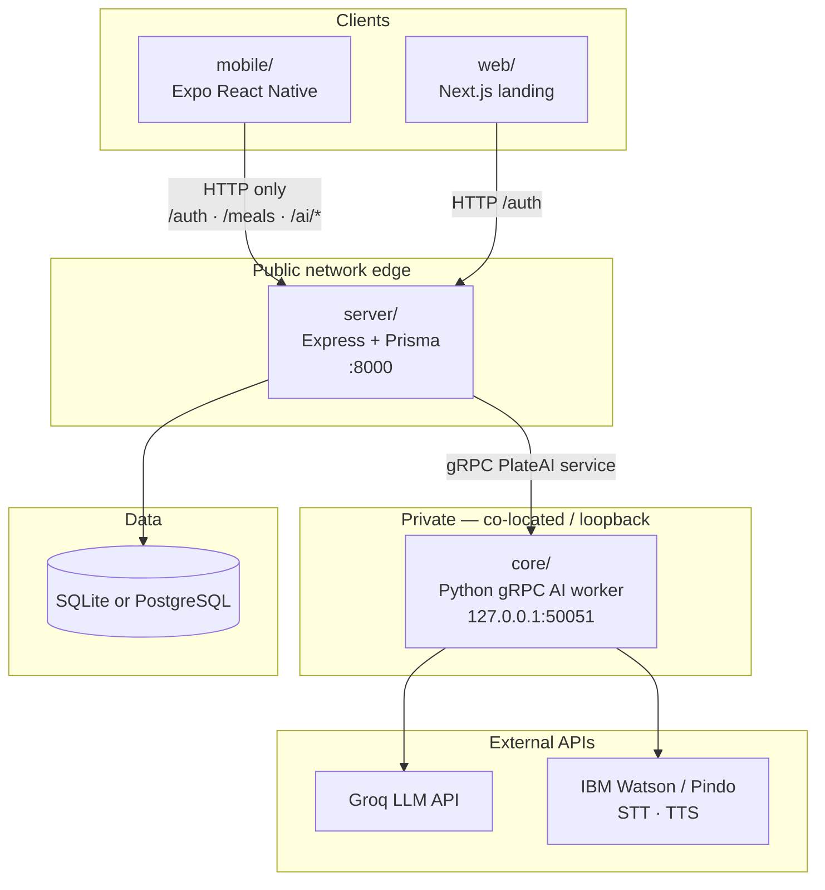
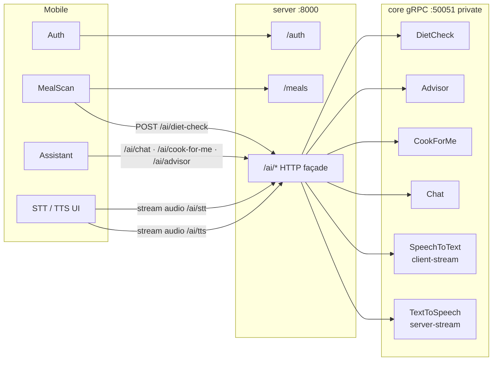

# PlateAI: AI-Powered Meal Analysis App - Your AI Dietitian

An AI-powered mobile and web application designed to analyze meals through images and videos. Our app assesses nutrient balance and offers personalized dietary suggestions to help users achieve their health goals.

## Getting Started

```bash
./setup.sh   # install dependencies, generate gRPC stubs, configure database, seed data (run once)
./start.sh   # start private core (gRPC) + public server (HTTP)
```

See [SETUP.md](./SETUP.md) for the full setup guide, environment variable reference, SQLite/PostgreSQL switching, and troubleshooting.

## Features

- **Image meal analysis**: Capture a meal; AI extracts edible items and estimated macros/micros.
- **Nutrient assessment**: Insights into the balance of calories, carbs, proteins, fats, sodium, etc.
- **Personalized suggestions**: Advice and “cook for me” meals from profile + meal history.
- **Dietitian chat**: Conversational nutrition Q&A.
- **Speech (EN / Kinyarwanda)**: STT and TTS streamed through the app server (no client→core path).

## Technology Stack

| Layer | Stack |
|-------|--------|
| Mobile | Expo / React Native, Expo Router, Recoil, NativeWind |
| Web (marketing) | Next.js, Tailwind |
| Public API | Express, Prisma, JWT, bcrypt, gRPC client |
| Private AI core | Python gRPC, Groq (Llava / Llama / Gemma), IBM Watson STT/TTS |
| Data | SQLite (default) or PostgreSQL |

---

## Architecture

PlateAI is a **monorepo** with a **public HTTP API** and a **private gRPC AI worker**.

| Path | Role | Exposure |
|------|------|----------|
| `mobile/` | Primary product (Expo app) | Talks **only** to `server` |
| `web/` | Marketing / auth landing (Next.js) | Talks **only** to `server` |
| `server/` | Auth, meals, and AI HTTP façade | Public HTTP `:8000` |
| `core/` | AI inference (vision, chat, cook, STT/TTS) | **Private gRPC** `127.0.0.1:50051` |
| `proto/` | Shared `ai.proto` contract | Build-time only |

**Clients never know `core` exists.** All AI routes are under `server` (`/ai/*`), which dials core over gRPC on loopback.

STT/TTS are **streamed** both ways (client ↔ server HTTP, server ↔ core gRPC). Audio is held in memory only — **no disk writes** on server or core.

### System context



### Request flow (including streaming voice)



### Top-level layout (relevant paths)

```text
plateAI/
├── setup.sh / start.sh
├── proto/ai.proto              # single source of truth for core RPCs
├── core/                       # private gRPC worker
│   ├── app.py / grpc_server.py
│   ├── generated/              # protoc output (setup.sh)
│   └── services/               # diet_check, advisor, chat, cook, stt, tts
├── server/                     # public Express API
│   └── src/
│       ├── grpc/coreClient.ts  # dials CORE_GRPC_URL
│       └── modules/ai/         # /ai HTTP → gRPC
├── mobile/                     # Expo — axios → server only
└── web/
```

### Public AI HTTP API (server)

| Method | Path | Notes |
|--------|------|--------|
| GET | `/ai/health` | Checks gRPC core liveness |
| POST | `/ai/diet-check` | JSON `{ base64 }` or `{ image }` |
| POST | `/ai/advisor` | JSON profile + meals |
| POST | `/ai/cook-for-me` | JSON user + meal_history |
| POST | `/ai/chat` | JSON `{ prompt }` |
| POST | `/ai/stt?language=en\|rw` | **Stream** multipart `audio`, raw `audio/*`, or JSON base64 → gRPC client-stream |
| POST | `/ai/tts?language=en\|rw` | JSON `{ text }` → **chunked** `audio/mpeg` body from gRPC server-stream |

## Authors

- MUTESA CEDRIC [(@Mutesa-Cedric)](https://github.com/Mutesa-Cedric)
- MURANGWA PACIFIQUE [(@pacifiquem)](https://github.com/pacifiquem)
- MANZI ISRAEL [(@israelmanzi)](https://github.com/israelmanzi)
- DAN BELLAMY [(@Bellamy01)](https://github.com/Bellamy01)

Reach out to us before any commercial use!
